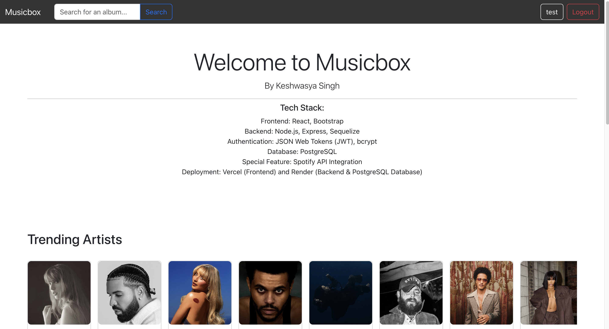
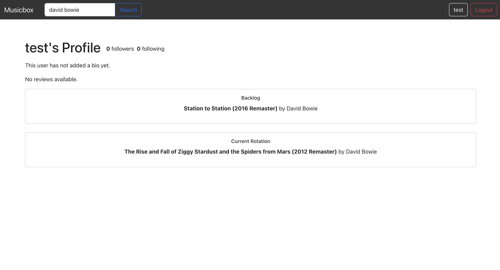
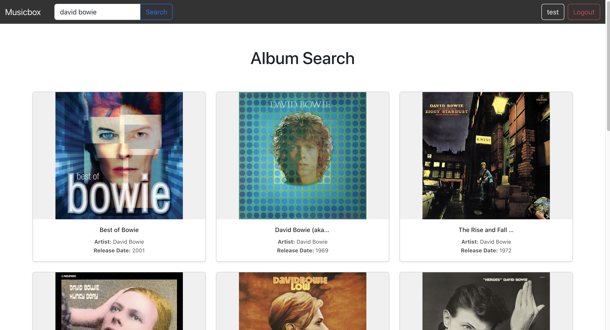

# Musicbox 🎶

**Musicbox** is a web application that lets users catalog and review music albums, similar to how IMDb or Letterboxd works for movies. Users can save albums they've listened to, write reviews, and rate them. The application is designed to make it easy to organize music experiences and discover new albums through a social network of music lovers.

## Project Demo
[**Live Demo**](https://musicbox-tawny.vercel.app/) - Hosted on Vercel and Render

## Screenshots

### Homepage

### User Dashboard

### Album Search

## Technologies Used

### Frontend
- **React** - Component-based UI development
- **Bootstrap** - Styling and responsive design
- **Axios** - For handling HTTP requests from the frontend to the backend

### Backend
- **Node.js** - Backend server with JavaScript
- **Express** - Simplified API endpoint creation
- **Sequelize** - Object-relational mapping for PostgreSQL
- **JSON Web Tokens (JWT)** - Authentication and authorization
- **bcrypt** - Password hashing for secure storage

### Database
- **PostgreSQL** - Relational database to store user, album, and review data
- **Render** - Hosting for the PostgreSQL database and backend server

### Deployment
- **Vercel** - Frontend hosting for quick, serverless deployment
- **Render** - Hosting for the backend API and PostgreSQL database

### Skills Demonstrated
- **Full-Stack Development**: Building a complete web application from frontend to backend.
- **Authentication**: Implementing secure login and registration with JWT and bcrypt.
- **Database Management**: Creating and managing database tables, relationships, and migrations.
- **RESTful API**: Designing a REST API to support CRUD operations.
- **Web Deployment**: Hosting and managing deployment processes on Vercel and Render.

## Features

### User Authentication
- **Register**: Users can sign up with a unique username, email, and password.
- **Login**: Secure login with JWT-based authentication.
- **Session Management**: Token-based authentication keeps the user logged in across sessions.

### User Dashboard
- **Profile Page**: Displays user information, including profile picture, bio, followers, following, and a list of albums in the backlog and current rotation.
- **Reviews and Ratings (In progress)**: Users can leave reviews and ratings for albums and see reviews from users they follow.

### Album Management
- **Search Albums**: Users can search for albums to add to their collection.
- **Backlog & Current Rotation**: Separate sections to manage albums they plan to listen to or are currently listening to.

### Social Features
- **Following System (In Progress)**: Users can follow other users to see their reviews and album choices.
- **User Feed (In Progress)**: Displays recent reviews from people they follow, making it easy to discover new music.

### Spotify API Integration
- **Spotify Integration**: Deep integration to pull album data directly from Spotify's API.

## Setup and Installation

To get the project up and running on your local machine:

1. **Clone the repository**:
   git clone https://github.com/your-username/musicbox.git
   cd musicbox

2. **Install dependencies**:
   npm install

3. **Configure Environment Variables**:
   Create a .env file in both the frontend and backend directories and add the required environment variables:

   - For the backend:
        DATABASE_URL=your_postgresql_database_url
        JWT_SECRET=your_jwt_secret
        SPOTIFY_CLIENT_ID=your_spotify_client_id
        SPOTIFY_CLIENT_SECRET=your_spotify_client_secret

   - For the frontend:
        REACT_APP_SPOTIFY_CLIENT_ID=7f4dd5f12f6d49069c927ea1b54e7e72
        REACT_APP_SPOTIFY_CLIENT_SECRET=a4e96e3c07f941ad8d6bc55604d6b84a
        REACT_APP_API_URL=https://musicbox-1964.onrender.com

4. **Run Migrations**:
    npx sequelize-cli db:migrate

5. **Start the Development Servers**:
    - Frontend (from the frontend dir)
        npm start
    - Backend (from the backend dir)
        npm start
